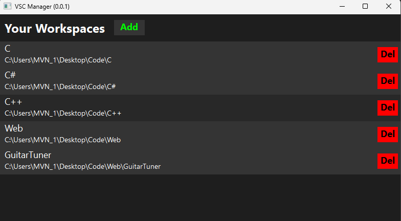

# VSCManager for Windows

### A Visual Studio Code workspace manager to easily keep track of and open workspaces in VS Code in one click! Written with C++20 leveraging [wxWidgets](https://www.wxwidgets.org/) GUI framework

## Website
[https://www.vscmanager.net](https://vscmanager.net/)

## Screenshot

(if unfamiliar with wxWidgets and worried about memory leaks from the "new" allocations in the code, the ownership is passed to the window hierarchy, so the memory is handled by the framework on destruction)
